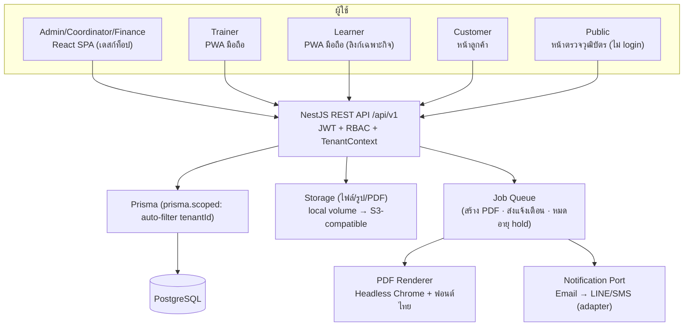
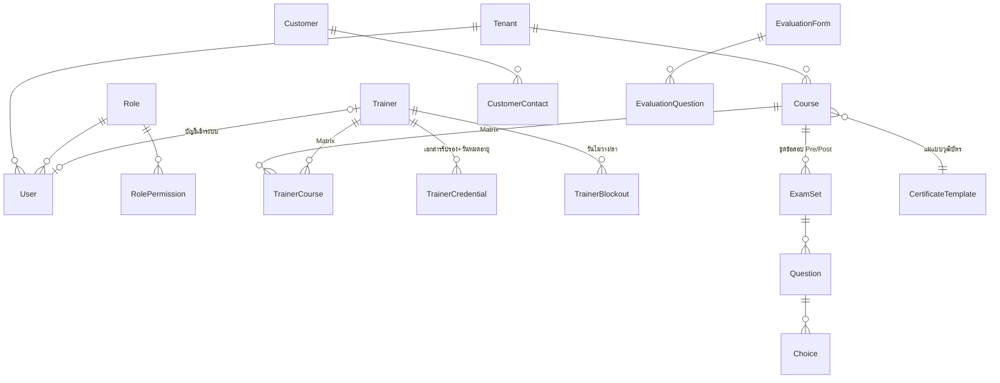
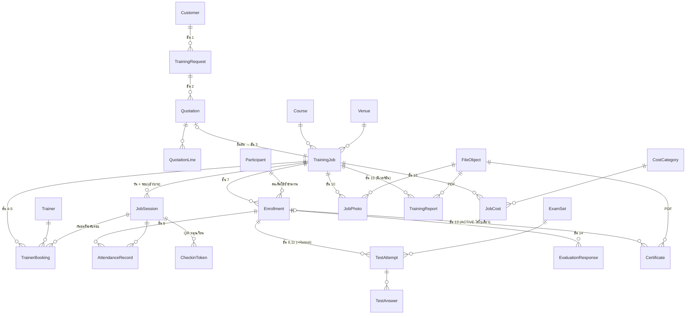
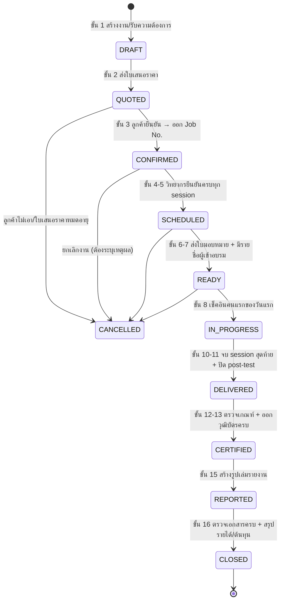
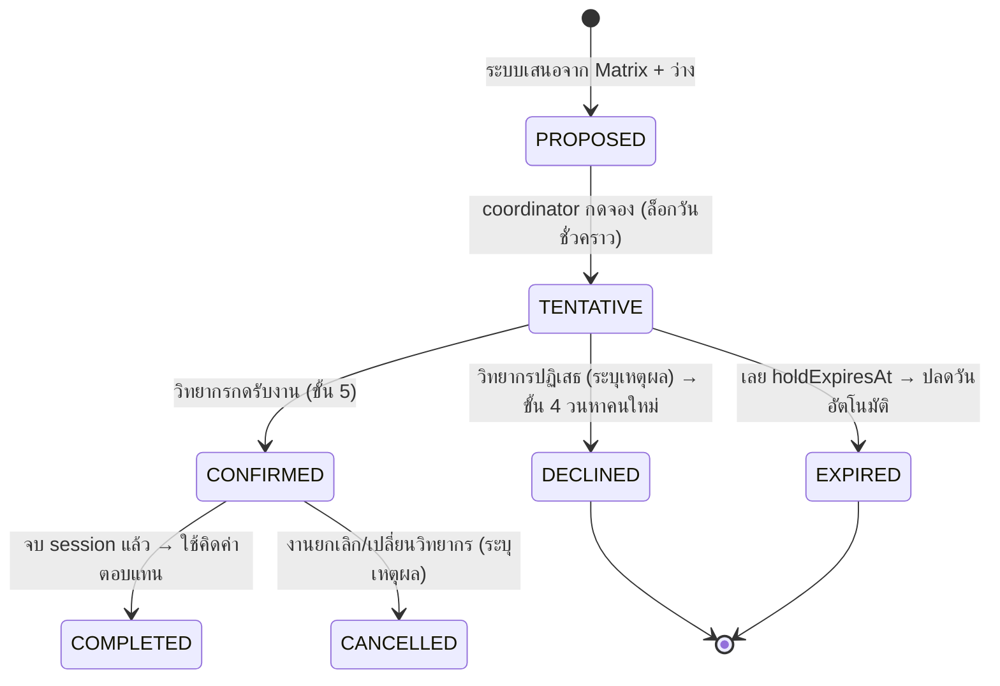
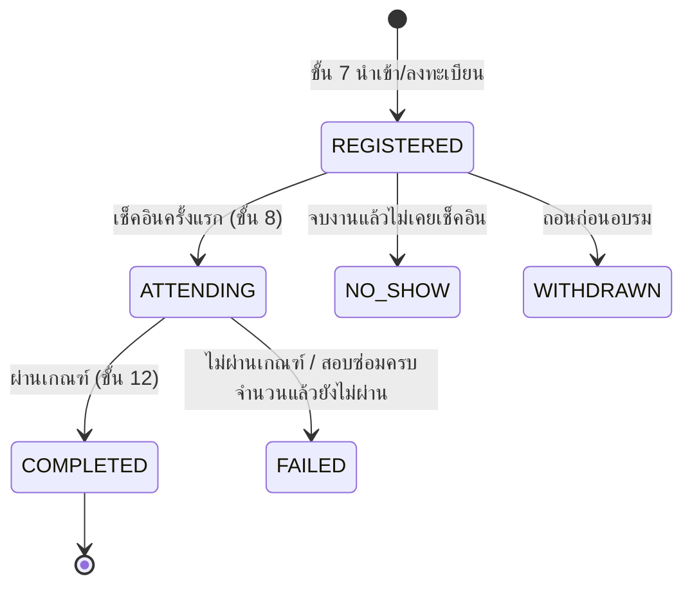

# เฟส 2 — System Design · TrainFlow

> สถานะ: **ร่างรอรีวิว** · อัปเดต 2026-08-24 · ต่อจาก [`01-requirements.md`](01-requirements.md)
> ออกแบบ **ครบทั้งกระบวน 16 ขั้นในรอบเดียว** ตามที่เจ้าของโครงการสั่ง — เพราะหน้าจอในระบบนี้
> กินข้อมูลต่อกันเป็นทอด ๆ ถ้าออกแบบทีละหน้าจะเจอปัญหาแบบเดียวกับที่ DCS-TMS เจอ
> (ดู [`00-lessons-from-dcs-tms.md`](00-lessons-from-dcs-tms.md))
>
> **เอกสารนี้เป็น contract:** เพิ่ม/แก้ field · endpoint · enum · สถานะ ต้องแก้ที่นี่ **ก่อน** เขียนโค้ด
> แล้ว sync กับ `openapi.yaml` · `prisma/schema.prisma` · `packages/shared-types`

## สารบัญ
1. สถาปัตยกรรม & Tech Stack · 2. Data Model (ER) · 3. **สายข้อมูลข้ามหน้าจอ (Data Spine)** ·
4. State Machines · 5. Business Rules & สูตรคำนวณ · 6. API Design · 7. UI/UX Flow รายบทบาท ·
8. เอกสาร PDF (วุฒิบัตร/รายงาน) · 9. QR & ความปลอดภัย · 10. Config/Master ที่ปรับผ่านหน้าจอ ·
11. Exception & Invariants · 12. Multi-tenancy · 13. NFR mapping + Definition of Done

---

## 1. สถาปัตยกรรม & Tech Stack

### 1.1 ภาพรวม

**หลักที่ยึด:** REST + monorepo เดียว · **ไม่แยก microservice** (ขนาดงานไม่คุ้ม) ·
งานหนัก (PDF/แจ้งเตือน) เป็น **background job** ไม่บล็อกหน้าจอ · external ทุกตัวผ่าน **Port/Adapter**

### 1.2 Tech Stack และเหตุผล

| ชั้น | เลือก | เหตุผล |
|---|---|---|
| Backend | **NestJS + TypeScript** | โครงสร้างชัด (module/service/controller) · ทีมใช้กับ dcs-tms อยู่แล้ว · DI ทำให้เทสต์ง่าย |
| ORM | **Prisma** | schema เป็น SSOT ของ DB · `$extends` ทำ tenant auto-filter ได้ (บทเรียน L11) |
| DB | **PostgreSQL 16** | transaction · partial unique index (กันจองซ้อน) · JSONB (snapshot รายงาน) |
| Frontend | **React + Vite + TypeScript** | ใช้ shared-types ร่วมกับ backend → compiler จับ contract หลุด |
| มือถือ | **PWA** (ไม่ใช่ native) | วิทยากร/ผู้เข้าอบรมเปิดจากลิงก์ได้ทันที ไม่ต้องติดตั้ง — สำคัญมากกับผู้เข้าอบรมที่มาครั้งเดียว |
| PDF | **Headless Chromium (HTML→PDF)** | วุฒิบัตร/รูปเล่มรายงานต้องสวยและมีภาพ · ฟอนต์ไทย (Sarabun) ฝังได้ · แม่แบบแก้เป็น HTML ได้โดยไม่ต้องคอมไพล์ |
| Excel | **exceljs** | นำเข้ารายชื่อ + ส่งออกรายงาน |
| Queue | **BullMQ + Redis** | สร้างวุฒิบัตร 60 ใบ/ส่งแจ้งเตือน/ปลด hold ที่หมดอายุ ต้องทำนอก request |
| Storage | **local volume → S3-compatible** | ผ่าน `StoragePort` เปลี่ยนที่เก็บได้โดยไม่แก้ business logic |
| Test | **vitest** (unit + integration ยิง Postgres จริง) | บทเรียน L11 — mock Prisma พิสูจน์ tenant isolation/partial-unique ไม่ได้ |
| E2E | **puppeteer-core + Chrome** (`.claude/agents/e2e-tester.md`) | บทเรียน L10 — บั๊กข้ามบทบาทเจอได้ด้วยการเล่นจอจริงเท่านั้น |
| Deploy | **Docker Compose** | ขึ้น cloud/on-prem ได้เหมือนกัน |

> **ต่างจาก dcs-tms ตั้งใจ 3 จุด:** (1) มี **queue + storage + PDF ตั้งแต่ M0** ไม่ใช่ไปเพิ่มตอน M8
> (2) coverage ตั้ง **global threshold** ไม่ใช่ไล่เติมรายไฟล์ (3) `EXPORT` เป็น permission action ตั้งแต่ออกแบบ RBAC

---

## 2. Data Model (ER)

### 2.1 กลุ่ม Master + คน

### 2.2 กลุ่มงานอบรม (แกนกลาง)

### 2.3 คำอธิบาย entity ที่ตัดสินใจไม่ตรงไปตรงมา

| Entity | ทำไมออกแบบแบบนี้ |
|---|---|
| **`JobSession`** (jobId, `sessionDate @db.Date`, `slot` AM/PM) | เป็น **หน่วยเล็กที่สุดของเวลา** ที่ทั้งระบบใช้ร่วมกัน — ใช้ทั้งกันวิทยากรชนงาน, เช็คชื่อเช้า/บ่าย, และคิดชั่วโมงเข้าอบรม. ถ้าไม่มีชั้นนี้ หลักสูตร 21 ชม. (3 วัน) จะเช็คชื่อและคิด % ไม่ได้ |
| **`TrainerBooking`** ผูก **jobSession** ไม่ใช่ผูก job | ทำให้ **กันจองซ้อนได้ที่ระดับข้อมูล** ด้วย partial unique `(tenantId, trainerId, sessionDate, slot) WHERE status IN (TENTATIVE, CONFIRMED)` — ตรงตามจุดขายที่ 1 และบทเรียน L2 |
| **`Participant` แยกจาก `Enrollment`** | คนคนเดียวอบรมหลายหลักสูตรข้ามปี → ต้องดูประวัติรวมและออกวุฒิบัตรย้อนดูได้ (สมมติฐาน §6.4) |
| **`Certificate` เก็บ snapshot** (ชื่อ, หลักสูตร, ชั่วโมงจริง, %เข้าอบรม, คะแนน, เกณฑ์ที่ใช้ตอนนั้น) | บทเรียน L4 — ถ้าแอดมินแก้เกณฑ์ผ่านปีหน้า **ใบที่ออกไปแล้วต้องไม่เปลี่ยนความหมาย** และหน้า verify ต้องอ่านจาก snapshot ไม่ใช่คำนวณใหม่ |
| **`TrainingReport` มี `version` + `summaryJson`** | รายงานที่ส่งลูกค้าไปแล้วต้องสร้างซ้ำได้เหมือนเดิม แม้ข้อมูลจะถูกแก้ภายหลัง (I3) |
| **`JobCost` แยกแถวตามหมวด** ไม่ใช่ 9 คอลัมน์ | หมวดค่าใช้จ่ายเป็น master ที่เพิ่มเองได้ (A6) — ถ้าทำเป็นคอลัมน์ตายตัวจะเพิ่มหมวดไม่ได้โดยไม่แก้โค้ด |
| **`FileObject` กลาง** | ไฟล์ทุกชนิดผ่านตารางเดียว → คุมสิทธิ์/โควตา/การลบได้ที่เดียว (บทเรียน L6) |
| **`CheckinToken` หมุนเวียน** | กัน "ถ่ายรูป QR ส่งให้เพื่อนเช็คชื่อแทน" — ดู §9 |
| **`TrainerBlockout`** | วิทยากร freelance มีวันติดงานนอกระบบ ต้องกันวันได้เอง ไม่งั้น Booking Engine เสนอคนที่ไม่ว่างจริง |
| **`TrainerCredential` + `expiryDate`** | ยกแนวคิด `ExpiryDoc` ของ dcs-tms มาใช้ — เตือนก่อนคุณวุฒิ/ใบรับรองหมดอายุ (L6) |

### 2.4 ฟิลด์ "แผน vs จริง" ที่ต้องแยกคอลัมน์ (บทเรียน L4 — ห้ามเขียนทับ)

| เรื่อง | คอลัมน์แผน | คอลัมน์จริง | เอกสารปลายทางอ่าน |
|---|---|---|---|
| เวลาอบรม | `JobSession.plannedStart/End` | `JobSession.actualStart/End` | วุฒิบัตร + รายงาน = **จริง** |
| ชั่วโมงหลักสูตร | `Course.hours` | `Σ` ชั่วโมงจาก actual | วุฒิบัตร = **จริง**, เกณฑ์เทียบกับ `Course.hours` |
| วิทยากร | `TrainerBooking (CONFIRMED)` | `JobSession.actualTrainerIds` / booking ที่ `COMPLETED` | รายงาน + ต้นทุน = **จริง** |
| จำนวนคน | `TrainingJob.plannedHeadcount` | `COUNT(Enrollment)` / `COUNT(เช็คอินจริง)` | ใบเสนอราคา = แผน · รายงาน = **จริง** (ระบุชัดทั้ง 2 ตัวเลข) |
| สถานที่ | `TrainingJob.venueId` | `TrainingJob.actualVenueId` | รายงาน = **จริง** |

---

## 3. สายข้อมูลข้ามหน้าจอ (Data Spine) — ⭐ ส่วนสำคัญที่สุดของเอกสารนี้

> **วิธีใช้:** ก่อนเขียนหน้าจอไหนก็ตาม ให้หาแถวของหน้านั้นในตารางนี้ แล้วตรวจว่า
> *ข้อมูลที่หน้านี้ผลิต* ถูกใครใช้ต่อบ้าง — ถ้าหน้าปลายทางยังไม่มี ให้จองที่ไว้ใน API/ตารางก่อน
> **ฟิลด์ที่ไม่มีแถวปลายทาง = ไม่ต้องเก็บ** (guardrail 8)

### 3.1 ตารางไหลของข้อมูล (ต้นทาง → ปลายทาง)

| ข้อมูล | เกิดที่ (ขั้น/หน้าจอ) | เก็บที่ | ถูกใช้ต่อที่ |
|---|---|---|---|
| หลักสูตร: ชั่วโมง, เกณฑ์ผ่าน | ขั้น 0 · หน้า Master หลักสูตร | `Course.hours`, `minAttendancePct`, `minPostScorePct` | Booking (Matrix) · คิด %เข้าอบรม · **ตรวจเกณฑ์ผ่าน (12)** · วุฒิบัตร · รายงาน |
| Matrix วิทยากร×หลักสูตร | ขั้น 0 · หน้า Matrix | `TrainerCourse` | **Booking Engine (4)** — ตัวกรองชั้นแรก |
| อัตราค่าตอบแทนวิทยากร | ขั้น 0 · ทะเบียนวิทยากร | `Trainer.rateType/rateAmount` | ประมาณการตอนจอง (4) · **ค่าเริ่มต้นของต้นทุนค่าวิทยากร (16)** |
| ราคาขายหลักสูตร | ขั้น 0 | `Course.standardPrice` | ใบเสนอราคา (2) → `TrainingJob.sellPrice` → **รายได้ (16)** → Dashboard |
| วัน/รอบที่จัด | ขั้น 3 · หน้า Job | `JobSession` | Booking (4) · ใบมอบหมายงาน (6) · **QR เช็คชื่อ (8)** · ชั่วโมงจริง (10) · รายงาน |
| วิทยากรที่ยืนยัน | ขั้น 5 · หน้าวิทยากร (มือถือ) | `TrainerBooking.status=CONFIRMED` | ใบมอบหมายงาน (6) · **ปฏิทิน** · วุฒิบัตร (ชื่อผู้สอน) · รายงาน · **ต้นทุนค่าวิทยากร (16)** |
| รายชื่อผู้เข้าอบรม | ขั้น 7 · นำเข้า Excel/ลงทะเบียน | `Participant` + `Enrollment` | ใบเซ็นชื่อ · QR (8) · ข้อสอบ (9,11) · **วุฒิบัตร (13)** · รายงาน (15) |
| เวลาเช็คอิน | ขั้น 8 · มือถือผู้เข้าอบรม | `AttendanceRecord.checkInAt` | **%เข้าอบรม → เกณฑ์ผ่าน (12)** · วุฒิบัตร (ชั่วโมง) · รายงาน · ใบวางบิลกรณีคิดตามหัวที่มาจริง |
| คะแนน Pre-test | ขั้น 9 · มือถือ | `TestAttempt(kind=PRE).score` | **รายงาน: วิเคราะห์พัฒนาการ (15)** เท่านั้น (ไม่มีผลต่อการผ่าน — สมมติฐาน §6.6) |
| เวลาเริ่ม–จบจริง + รูปกิจกรรม | ขั้น 10 · มือถือวิทยากร | `JobSession.actualStart/End`, `JobPhoto` | **ชั่วโมงจริงบนวุฒิบัตร** · **ภาพในรูปเล่มรายงาน (15)** |
| คะแนน Post-test (+Retest) | ขั้น 11 · มือถือ | `TestAttempt(kind=POST)` ทุกครั้ง | **เกณฑ์ผ่าน (12)** · วุฒิบัตร · รายงาน (ระบุจำนวนครั้งที่สอบ) |
| ผลตรวจเงื่อนไขผ่าน | ขั้น 12 · คำนวณตอนอ่าน | *(derived)* → snapshot ตอนออกใบ | **ออกวุฒิบัตร (13)** · รายงาน · Dashboard pass rate |
| เลขที่วุฒิบัตร + QR | ขั้น 13 | `Certificate.certNo`, `verifyToken` | ดาวน์โหลดของผู้เข้าอบรม · **หน้า verify สาธารณะ** · รายงาน (ภาคผนวก) |
| ผลประเมินความพึงพอใจ | ขั้น 14 · มือถือ | `EvaluationResponse` | **รายงาน (15)** · **คะแนนประสิทธิภาพวิทยากร (Dashboard)** |
| ต้นทุนตามหมวด | ขั้น 16 · หน้าการเงิน | `JobCost` | **กำไร/มาร์จิ้นต่องาน** · Dashboard ผู้บริหาร · การเตือนมาร์จิ้นต่ำ |
| สถานะปิดงาน | ขั้น 16 | `TrainingJob.closedAt`, `lockedAt` | ล็อกการแก้ย้อนหลัง · Dashboard "งานค้างปิด" |

### 3.2 ตัวเลขที่โผล่หลายหน้า — ต้องมาจาก helper ตัวเดียว (บทเรียน L8)

| ตัวเลข | สูตรกลาง (ที่เดียว) | โผล่ที่ |
|---|---|---|
| `attendancePct` | `Σ ชั่วโมงของ session ที่เช็คอิน / Course.hours × 100` | หน้า Job · หน้าผู้เข้าอบรม · เกณฑ์ผ่าน · วุฒิบัตร · รายงาน · Dashboard |
| `postScorePct` | `คะแนนครั้งที่ดีที่สุดของ POST / maxScore × 100` | เหมือนข้างบน |
| `isPassed` | `attendancePct ≥ course.minAttendancePct AND postScorePct ≥ course.minPostScorePct` | ขั้น 12 · 13 · รายงาน · Dashboard |
| `jobRevenue` | `sellPrice − discount` | หน้า Job · การเงิน · Dashboard |
| `jobCostTotal` | `Σ JobCost.amount` | เหมือนข้างบน |
| `grossMargin%` | `(revenue − cost) / revenue × 100` | หน้าการเงิน · Dashboard · การเตือน |
| `trainerScore` | เฉลี่ยหมวด "วิทยากร" จาก `EvaluationResponse` ของงานที่สอน | หน้าวิทยากร · Dashboard ประสิทธิภาพวิทยากร |

> **กติกา:** สูตรเหล่านี้อยู่ใน `packages/shared-types` (pure function) เรียกใช้ได้ทั้ง backend และ frontend
> **ห้ามคำนวณซ้ำในหน้าจอ** และต้องมีเทสต์ที่เทียบตัวเลขระหว่างหน้า Job กับ Dashboard ให้เท่ากัน

### 3.3 เส้นทางที่ต้องมี integration test เดินครบเส้น (บทเรียน L3)

| # | เส้น | พิสูจน์อะไร |
|---|---|---|
| E2E-1 | สร้าง Job → จองวิทยากร → **วิทยากรเห็นงานในหน้าตัวเอง** → กดยืนยัน → ปฏิทินล็อกวัน | งานไม่หายระหว่างทาง (แบบ `driverId=null` ของ dcs-tms) |
| E2E-2 | จองวิทยากรคนเดิม วันเดิม รอบเดิม อีกงาน → **ต้องถูกปฏิเสธ** | กันชนที่ระดับข้อมูล ไม่ใช่แค่ซ่อนปุ่ม |
| E2E-3 | นำเข้ารายชื่อ → เช็คอินครบ → ทำ post-test ผ่าน → **วุฒิบัตรออกอัตโนมัติ + verify ผ่าน QR ได้** | สายข้อมูลขั้น 7→13 ครบ |
| E2E-4 | เช็คอินไม่ครบเกณฑ์ → **ต้องไม่ออกวุฒิบัตร** และรายงานต้องบอกเหตุผล | เกณฑ์ผ่านทำงานจริง |
| E2E-5 | จบงาน → กด Generate Report → **PDF มีครบ 8 ส่วน** และตัวเลขตรงกับหน้า Job | killer feature ใช้ได้จริง |
| E2E-6 | บันทึกต้นทุน → ปิดงาน → **กำไร/มาร์จิ้นตรงกับ Dashboard** | L8 ตัวเลขตรงกันข้ามหน้า |
| E2E-7 | tenant A เรียก id ของ tenant B → **404** | ข้อมูลไม่รั่วข้ามบริษัท |

---

## 4. State Machines

> ทุกการเปลี่ยนสถานะต้องผ่านตาราง transition ใน `packages/shared-types`
> **API ปฏิเสธ transition ที่ไม่อยู่ในตาราง (409 `INVALID_TRANSITION`)** — ไม่ใช่แค่ซ่อนปุ่มบนจอ (บทเรียน L11)

### 4.1 `TrainingJob` — แกนกลางของทั้งระบบ (ตรงกับผัง 16 ขั้น)

**กฎที่ผูกกับสถานะ**
- ออก **Job No. ตอนเข้า `CONFIRMED`** เท่านั้น (ก่อนหน้านั้นเป็นเลขร่าง) — เลขต้องไม่กระโดด/ไม่ซ้ำ
- `SCHEDULED` ต้อง **ทุก `JobSession` มี `TrainerBooking` สถานะ `CONFIRMED` อย่างน้อย 1 คน**
- `CANCELLED` → ปลด `TrainerBooking` ทุกใบเป็น `CANCELLED` และคืนวันในปฏิทิน (transaction เดียว)
- `CLOSED` → ตั้ง `lockedAt` **ล็อกการแก้ทุกอย่าง** (คะแนน/เช็คชื่อ/ต้นทุน) แก้ได้เฉพาะสิทธิ์สูง + ต้องมีเหตุผล + ลง audit
- ย้อนสถานะได้เฉพาะ `CLOSED → REPORTED` (เปิดงานใหม่) โดยสิทธิ์ Admin เท่านั้น

### 4.2 `TrainerBooking` — จุดขายที่ 1

> **วันถูกล็อกเมื่อ `TENTATIVE` หรือ `CONFIRMED` เท่านั้น** — `PROPOSED` ไม่ล็อก (ไม่งั้นเสนอ 5 คนแล้ววันเต็มหมด)
> `holdExpiresAt` มาจาก config `booking.tentativeHoldHours` (ค่าเริ่มต้น 48 ชม.) มี background job ปลดให้

### 4.3 `Enrollment` — ผู้เข้าอบรมรายคน

### 4.4 อื่น ๆ

| Entity | สถานะ | หมายเหตุ |
|---|---|---|
| `TrainingRequest` | `NEW → QUOTED → CONVERTED` · `REJECTED` | คำขอจากลูกค้า (ขั้น 1) |
| `Quotation` | `DRAFT → SENT → ACCEPTED` · `REJECTED` · `EXPIRED` | `EXPIRED` อัตโนมัติจาก `validUntil` |
| `TestAttempt` | `IN_PROGRESS → SUBMITTED → GRADED` | ตรวจอัตโนมัติทันทีที่ submit; `EXPIRED` ถ้าเลยเวลาสอบ |
| `Certificate` | `ACTIVE → REVOKED` | ออกใหม่ = revoke ใบเก่า + สร้างใบใหม่ (เลขใหม่) ไม่แก้ใบเดิม |
| `TrainingReport` | ไม่มีสถานะ — เป็น **เวอร์ชัน** | สร้างใหม่ = เพิ่ม version ของเก่าอยู่ครบ |

---

## 5. Business Rules & สูตรคำนวณ (กติกากลาง — implement ที่เดียว)

| รหัส | กติกา | บังคับที่ |
|---|---|---|
| **BR-01** | วิทยากร 1 คน รับได้ **1 งานต่อ 1 รอบ (วัน+เช้า/บ่าย)** | partial unique index + ตรวจใน transaction |
| **BR-02** | จองได้เฉพาะวิทยากรที่อยู่ใน **Matrix ของหลักสูตรนั้น** และคุณสมบัติยังไม่หมดอายุ | service ตอนสร้าง booking (422 `TRAINER_NOT_QUALIFIED`) |
| **BR-03** | `%เข้าอบรม = Σ ชั่วโมงของ session ที่เช็คอิน ÷ Course.hours × 100` | pure function ใน shared-types |
| **BR-04** | ใช้ **คะแนน post-test ครั้งที่ดีที่สุด** ในการตัดสินผ่าน (เก็บทุกครั้งที่สอบ) | shared-types |
| **BR-05** | **ผ่าน = ครบทั้ง 2 เงื่อนไข** (%เข้าอบรม ≥ เกณฑ์ **และ** post ≥ เกณฑ์) | shared-types (ใช้ร่วมทุกหน้า) |
| **BR-06** | สอบซ่อมได้ไม่เกิน `Course.maxRetest` ครั้ง (ค่าเริ่มต้นจาก config) | API `POST /test-attempts` (409 `MAX_RETEST_REACHED`) |
| **BR-07** | ออกวุฒิบัตรได้เฉพาะ `Enrollment` ที่ `isPassed = true` และงานอยู่ `DELIVERED` ขึ้นไป | service (422 `CRITERIA_NOT_MET`) |
| **BR-08** | 1 `Enrollment` มีวุฒิบัตร **`ACTIVE` ได้ใบเดียว** | partial unique index |
| **BR-09** | วุฒิบัตรเก็บ **snapshot** ของเกณฑ์+ผลที่ใช้ตอนออก — แก้เกณฑ์ทีหลังไม่กระทบใบเก่า | `Certificate.criteriaSnapshot` (JSONB) |
| **BR-10** | `รายได้ = ราคาขาย − ส่วนลด` · `ต้นทุน = Σ JobCost` · `กำไร = รายได้ − ต้นทุน` · `margin% = กำไร ÷ รายได้ × 100` | shared-types |
| **BR-11** | รายได้ = 0 → **ไม่คิด margin (null)** ห้ามหารศูนย์/แสดง 0% | shared-types (บทเรียน L9) |
| **BR-12** | ค่าตอบแทนวิทยากร **prefill จากอัตราในทะเบียน** แต่แก้ได้ (ค่าจริงชนะเสมอ) | service ตอนสร้าง `JobCost` |
| **BR-13** | เตือนเมื่อ `margin% < config.finance.marginAlertPct` | คำนวณตอนอ่าน + แสดงบนหน้า Job/Dashboard |
| **BR-14** | เช็คอินได้เฉพาะ **ช่วงเวลาที่เปิดของ session นั้น** (`config.attendance.windowMinutes` ก่อน/หลัง) | API (422 `CHECKIN_WINDOW_CLOSED`) |
| **BR-15** | เช็คอินซ้ำใน session เดิม = **ไม่สร้างแถวใหม่** (idempotent) คืนผลเดิม | unique `(enrollmentId, jobSessionId)` |
| **BR-16** | ทุกการแก้ไข attendance/คะแนน/ต้นทุนย้อนหลัง ต้องเก็บ **ใครแก้ เมื่อไร เหตุผลอะไร** | `AuditLog` + คอลัมน์ `recordedBy`/`note` |
| **BR-17** | หลัง `CLOSED` (`lockedAt` ไม่ null) แก้ข้อมูลไม่ได้ — ยกเว้นสิทธิ์ Admin + เหตุผล | guard ทุก mutation ที่ผูก job |
| **BR-18** | ลบ master ที่ถูกใช้แล้วไม่ได้ → **soft-delete** (`isActive=false`) | ทุก master (409 `MASTER_IN_USE`) |
| **BR-19** | ข้อมูลไม่พอคำนวณ → **`BLOCKED` + เหตุผล** ห้ามคืน 0 เงียบ ๆ (เช่น หลักสูตรไม่ตั้งชั่วโมง → คิด % ไม่ได้) | pattern เดียวกับ `calcStatus` ของ dcs-tms |
| **BR-20** | เลขเอกสาร (`Job No.`, `Cert No.`, `QT No.`) สร้างใน transaction เดียวกับการสร้างเอกสาร ห้ามซ้ำ/ข้าม | sequence ต่อ tenant ต่อปี |

---

## 6. API Design (endpoint หลัก)

> `/api/v1` · JWT · ทุก endpoint (ยกเว้นกลุ่ม public) ผ่าน RBAC และ tenant scope
> mutation ที่กระทบเงิน/วุฒิบัตร/การจอง รองรับ **`Idempotency-Key`**

| กลุ่ม | Endpoint | หมายเหตุ |
|---|---|---|
| **Master** | `GET/POST/PUT /courses` · `/trainers` · `/trainers/:id/courses` (Matrix) · `/trainers/:id/blockouts` · `/customers` · `/venues` · `/cost-categories` · `/exam-sets` · `/evaluation-forms` | soft-delete ทั้งหมด |
| **คำขอ/เสนอราคา** | `POST /training-requests` (ลูกค้าส่งเองได้) · `POST /quotations` · `POST /quotations/:id/send` · `POST /quotations/:id/accept` | accept → สร้าง Job + Job No. |
| **งานอบรม** | `GET/POST /jobs` · `GET /jobs/:id` · `PATCH /jobs/:id` · `POST /jobs/:id/sessions` · `POST /jobs/:id/cancel` · `POST /jobs/:id/close` | `GET /jobs/:id` คืน **สรุปครบเส้น** (session, วิทยากร, ผู้เข้าอบรม, %ผ่าน, การเงินตามสิทธิ์) |
| **Booking ⭐** | **`GET /jobs/:id/trainer-options`** → รายชื่อ qualified × available + ค่าตอบแทนประมาณการ + เหตุผลที่ถูกตัด · `POST /jobs/:id/bookings` (TENTATIVE) · `POST /bookings/:id/confirm` · `POST /bookings/:id/decline` | ต้องคืน **ทั้งคนที่เลือกได้และคนที่ถูกตัดพร้อมเหตุผล** (บทเรียน dcs-tms: รถที่เข้าเกณฑ์หายจากจอ) |
| **ปฏิทิน** | `GET /calendar?from&to&view=job|trainer` | Public/In-house/ตารางวิทยากร ในชุดเดียว |
| **วิทยากร (มือถือ)** | `GET /me/bookings` · `POST /bookings/:id/confirm` · `GET /me/jobs/:id` (ใบมอบหมาย+แผนที่) · `POST /sessions/:id/start` · `POST /sessions/:id/finish` · `POST /jobs/:id/photos` | |
| **ผู้เข้าอบรม** | `POST /jobs/:id/enrollments` · `POST /jobs/:id/enrollments/import` (Excel, ตรวจก่อนนำเข้า) · `GET /participants/:id/history` | |
| **เช็คชื่อ** | `GET /sessions/:id/checkin-qr` (token หมุน) · **`POST /checkin`** (learner) · `POST /sessions/:id/attendance` (บันทึกแทน + เหตุผล) · `GET /sessions/:id/attendance/live` | |
| **สอบ/ประเมิน** | `GET /me/tests` · `POST /test-attempts` · `POST /test-attempts/:id/submit` · `POST /evaluations` | ตรวจอัตโนมัติตอน submit |
| **วุฒิบัตร** | `GET /jobs/:id/certificate-preview` (ใครผ่าน/ไม่ผ่าน+เหตุผล) · `POST /jobs/:id/certificates/issue` (async) · `POST /certificates/:id/revoke` · `GET /me/certificates` | |
| **รายงาน ⭐** | `POST /jobs/:id/report` (async → เวอร์ชันใหม่) · `GET /jobs/:id/reports` · `GET /reports/:id/download` | ต้องมีสิทธิ์ `EXPORT` |
| **การเงิน** | `GET/POST/PUT /jobs/:id/costs` · `GET /jobs/:id/pnl` | เห็นเฉพาะ Finance/Executive/Admin |
| **Dashboard** | `GET /dashboard/summary` · `GET /analytics/trainers` · `GET /analytics/courses` | ใช้ helper เดียวกับหน้ารายละเอียด (L8) |
| **Public (ไม่ login)** | **`GET /verify/:certNo?t=<token>`** · `GET /public/courses` · `POST /public/enroll` | rate-limit + เปิดเผยข้อมูลน้อยที่สุด |
| **Platform** | `GET/POST /platform/tenants` | เฉพาะ platform admin |

**มาตรฐาน error code** (ท้าย `openapi.yaml`): `INVALID_TRANSITION` · `TRAINER_NOT_QUALIFIED` ·
`TRAINER_DOUBLE_BOOKED` · `BOOKING_EXPIRED` · `CHECKIN_WINDOW_CLOSED` · `MAX_RETEST_REACHED` ·
`CRITERIA_NOT_MET` · `CERT_ALREADY_ISSUED` · `JOB_LOCKED` · `MASTER_IN_USE` · `CROSS_TENANT_FORBIDDEN` · `EXPORT_FORBIDDEN`

---

## 7. UI/UX Flow รายบทบาท

**Coordinator (เดสก์ท็อป)** — เมนู: ปฏิทิน · คำขอ/ใบเสนอราคา · **งานอบรม** · ผู้เข้าอบรม · ข้อมูลหลัก
- หน้า **งานอบรม (Job detail)** = ศูนย์กลางของทุกอย่าง แบ่งแท็บตามผัง:
  `ภาพรวม | วัน/รอบ | วิทยากร | ผู้เข้าอบรม | เช็คชื่อ | คะแนน | วุฒิบัตร | รายงาน | การเงิน*`
  (*แท็บการเงินซ่อนตามสิทธิ์) — **แถบสถานะด้านบนแสดงขั้นที่ 1–16 ว่าอยู่ตรงไหนและอะไรค้าง**
- **ฟอร์มยาวเป็นหน้าเต็ม ไม่ใช่ popup** (บทเรียน L12)
- หน้าจองวิทยากร: เลือกวัน → รายชื่อ **แยก 2 กลุ่ม "เลือกได้" / "เลือกไม่ได้ + เหตุผล"** พร้อมค่าตอบแทนประมาณการ

**Trainer (มือถือ)** — เปิดมาเจอ: งานที่รอยืนยัน (ปุ่มรับ/ปฏิเสธ) → ตารางงานของฉัน →
ในงาน: แผนที่ · เบอร์ผู้ประสาน · ปุ่ม **เริ่มอบรม / จบอบรม** · ปุ่มถ่ายรูปกิจกรรม · รายชื่อผู้เข้าอบรม

**Learner (มือถือ ผ่านลิงก์เฉพาะกิจ)** — สแกน QR → ยืนยันตัวตน → เช็คอินสำเร็จ (จอเขียว) ·
ปุ่ม Pre-test/Post-test/ประเมิน ตามเวลาที่เปิด · ปุ่มดาวน์โหลดวุฒิบัตรเมื่อผ่าน

**Customer** — งานของบริษัทฉัน · สถานะแต่ละงาน · รายชื่อผ่าน/ไม่ผ่าน · ดาวน์โหลดรายงาน+วุฒิบัตร

**Executive** — Dashboard: รายได้/กำไรรายเดือน · งานที่มาร์จิ้นต่ำ · pass rate · ประสิทธิภาพวิทยากร

---

## 8. เอกสาร PDF (หัวใจของสินค้า)

| เอกสาร | สร้างจาก | ต้องมี |
|---|---|---|
| **ใบเสนอราคา** | `Quotation` | เลขที่ · ลูกค้า · หลักสูตร/วัน/จำนวนคน · ราคา/ส่วนลด/VAT (รอ Q5) · วันหมดอายุ |
| **ใบมอบหมายงานวิทยากร** | `TrainingJob` + `JobSession` + `Venue` | วัน/เวลา/สถานที่ · **QR ลิงก์แผนที่** · ผู้ประสานงาน+เบอร์ · อุปกรณ์/เอกสารที่ต้องเตรียม |
| **ใบเซ็นชื่อสำรอง** | `Enrollment` | ไว้ใช้ตอนเน็ตล่ม (กันไว้ก่อน) |
| **วุฒิบัตร** | `Certificate` (snapshot) | ชื่อ-นามสกุล · หลักสูตร · **ชั่วโมงจริง** · วันที่อบรม · เลขที่ · **QR verify** · ลายเซ็น (รอ Q6) |
| **รูปเล่มรายงาน ⭐** | `TrainingReport.summaryJson` | 8 ส่วนตามผังขั้น 15: ข้อมูลโครงการ · รายละเอียดหลักสูตร · รายชื่อ · Attendance · ผล Pre/Post + วิเคราะห์ · ผลประเมิน · ภาพกิจกรรม · สรุป+ข้อเสนอแนะ |

**หลักการ:** แม่แบบเป็น **HTML + CSS print** เก็บใน DB (แก้ได้โดยไม่ deploy) → render ด้วย headless Chrome →
เก็บเป็น `FileObject` · **ทุกฉบับที่ส่งออกต้องสร้างซ้ำได้เหมือนเดิม** (อ่านจาก snapshot ไม่ใช่ query สด) ·
ฟอนต์ไทยฝังในอิมเมจ (ห้ามพึ่ง font ของเครื่อง) · สร้างเป็น background job + แจ้งเมื่อเสร็จ

---

## 9. QR & ความปลอดภัย

**QR เช็คชื่อ (ขั้น 8)** — ปัญหาจริง: ถ่ายรูป QR ส่งให้เพื่อนเช็คชื่อแทน
- QR แสดงบนจอหน้าห้อง เข้ารหัส `{jobSessionId, slot, rotatingToken}` — **token หมุนทุก ~30 วินาที**
- ผู้เข้าอบรมเปิดลิงก์เฉพาะกิจของตัวเอง (ผูก `enrollmentId`) → สแกน → ระบบตรวจ token + ช่วงเวลา (BR-14)
- ทางเลือกสำรอง (เน็ตล่ม): กรอกรหัส 6 หลักที่หมุนพร้อมกัน หรือ coordinator เช็คชื่อแทน (บันทึกผู้แก้)

**QR วุฒิบัตร (ขั้น 13)** — `https://<host>/verify/<certNo>?t=<token>`
- `token` = HMAC ของ `certNo` + secret ต่อ tenant → เดาเลขไล่ดูข้อมูลคนอื่นไม่ได้
- หน้า verify (ไม่ต้อง login) แสดง **เท่าที่จำเป็น**: ชื่อ-นามสกุล · หลักสูตร · วันที่ · ชั่วโมง ·
  หน่วยงานผู้ออก · สถานะ (ใช้ได้/ถูกยกเลิก) — **ไม่แสดง** คะแนน · เลขบัตรประชาชน · ชื่อบริษัทลูกค้า
- rate-limit + ไม่ให้ index โดย search engine

**อื่น ๆ** — เลขบัตรประชาชน (ถ้าเก็บ ตาม Q3) **เข้ารหัสที่ระดับคอลัมน์** และแสดงแบบปิดบัง
(`x-xxxx-xxxxx-99-9`) ยกเว้นสิทธิ์เฉพาะ · ลิงก์เฉพาะกิจของ learner มีวันหมดอายุ ·
ไฟล์ทุกไฟล์เสิร์ฟผ่าน API ที่ตรวจสิทธิ์ **ห้ามเปิด path ตรงจาก storage**

---

## 10. Config / Master ที่ปรับผ่านหน้าจอ (ห้าม hard-code)

| กลุ่ม | คีย์ (ตัวอย่าง) | ค่าเริ่มต้น |
|---|---|---|
| เกณฑ์ผ่าน | `training.minAttendancePct` · `training.minPostScorePct` (override รายหลักสูตรได้) | 80 · 60 *(รอยืนยัน Q2)* |
| สอบซ่อม | `training.maxRetest` | 2 |
| เช็คชื่อ | `attendance.windowMinutes` (เปิดก่อน/ปิดหลัง) · `attendance.tokenRotateSec` | 30 · 30 |
| จองวิทยากร | `booking.tentativeHoldHours` · `booking.notifyBeforeDays` | 48 · 3 |
| เอกสาร | `docno.job` (`TR-{YYYY}-{#####}`) · `docno.cert` · `docno.quotation` · ปี พ.ศ./ค.ศ. บนเอกสาร | — |
| ใบเสนอราคา | `quotation.validDays` · `quotation.vatPct` · `quotation.whtPct` | 30 · 7 · 3 *(รอ Q5)* |
| การเงิน | `finance.marginAlertPct` | 20 |
| แจ้งเตือน | `notify.channels` · ผู้รับแต่ละเหตุการณ์ · `notify.credentialExpiryDays` | อีเมล · 30 |
| แม่แบบ | วุฒิบัตร · รูปเล่มรายงาน · ใบเสนอราคา · ใบมอบหมายงาน · **แบบประเมิน** | — |
| Master | หลักสูตร · วิทยากร · Matrix · ลูกค้า · สถานที่ · **หมวดค่าใช้จ่าย** · ชุดข้อสอบ · บทบาท/สิทธิ์ | — |

---

## 11. Exception & Invariants (บังคับตอน implement ไม่ใช่แค่ตอนเทสต์)

| เคส | มาตรการในดีไซน์ | อยู่ที่ |
|---|---|---|
| **วิทยากรชนงาน** (ร้ายแรงสุดของจุดขายที่ 1) | partial unique `(tenantId, trainerId, sessionDate, slot) WHERE status IN (TENTATIVE,CONFIRMED)` + ตรวจซ้ำใน transaction | `TrainerBooking` |
| **จองค้างเพราะวิทยากรไม่ตอบ** | `holdExpiresAt` + job ปลดอัตโนมัติ → กลับเข้าคิวเสนอใหม่ | `TrainerBooking` |
| **เสนอวิทยากรที่คุณสมบัติหมดอายุ** | ตรวจ `TrainerCourse.qualifiedUntil` + `TrainerCredential.expiryDate` ตอนคัดรายชื่อ | Booking service |
| **คนที่เข้าเกณฑ์หายจากจอ** (บั๊กจริงของ dcs-tms) | API คืน **ทั้ง `available` และ `excluded[] + reason`** ห้ามตัดทิ้งเงียบ | `trainer-options` |
| **สแกน QR แทนกัน** | token หมุน + ผูก `enrollmentId` ในลิงก์ส่วนตัว + ช่วงเวลา | §9 |
| **เช็คอินซ้ำ/กดรัว** | unique `(enrollmentId, jobSessionId)` + idempotent response | `AttendanceRecord` |
| **เน็ตหลุดตอนเช็คอิน/ส่งข้อสอบ** | client queue + retry ด้วย `Idempotency-Key` → ไม่เกิดแถวซ้ำ | API |
| **แก้เช็คชื่อ/คะแนนย้อนหลัง** | อนุญาตตามสิทธิ์ + บังคับ `reason` + `AuditLog` + **คำนวณผลผ่านใหม่ทันที** | BR-16 |
| **แก้เกณฑ์ผ่านหลังออกวุฒิบัตร** | `Certificate.criteriaSnapshot` — ใบเก่าคงความหมายเดิม | BR-09 |
| **ออกวุฒิบัตรซ้ำ** | partial unique 1 ACTIVE ต่อ enrollment · ออกใหม่ = revoke + เลขใหม่ | BR-08 |
| **วุฒิบัตรของคนไม่ผ่านหลุดออกไป** | `POST issue` ตรวจ `isPassed` ที่ server เสมอ (ไม่เชื่อ flag จาก client) | BR-07 |
| **เลขเอกสารซ้ำ/ข้าม** | sequence ต่อ tenant+ปี ใน transaction เดียวกับการสร้าง | BR-20 |
| **หารศูนย์ / ข้อมูลไม่พอ** | คืน `null` + `blockReason` ห้ามแสดง 0% | BR-11, BR-19 |
| **เงินคลาดเคลื่อน** | เงินทุกช่องเป็น `Decimal(14,2)` ห้าม Float | schema |
| **แก้ข้อมูลหลังปิดงาน** | `lockedAt` guard ทุก mutation ที่ผูก job | BR-17 |
| **ลบ master ที่มีประวัติ** | soft-delete ทุกตัว (`MASTER_IN_USE`) | BR-18 |
| **ข้อมูลรั่วข้าม tenant** | auto-filter ที่ Prisma layer + test isolation ทุกโมดูล | §12 |
| **ไฟล์รูป/PDF หลุดถึงคนนอก** | เสิร์ฟผ่าน API ที่ตรวจสิทธิ์ + คีย์ไฟล์เป็น uuid ไม่สื่อความหมาย | `StoragePort` |
| **ดูได้ ≠ โหลดออกได้** | action `EXPORT` แยกจาก `VIEW` ตั้งแต่ออกแบบ RBAC | บทเรียน L6 |
| **PDPA: ขอลบข้อมูลผู้เข้าอบรม** | ปิดบังข้อมูลส่วนบุคคล (anonymize) แต่คงสถิติ/เลขวุฒิบัตรไว้ | `Participant` |
| **นำเข้า Excel ข้อมูลเพี้ยน** | ตรวจ+แสดงผลลัพธ์ก่อนยืนยัน (dry-run) · ตรวจซ้ำคน · ปฏิเสธทั้งไฟล์ถ้าคอลัมน์ไม่ครบ | import service |
| **timezone / ปี พ.ศ.** | เก็บ UTC · ตีความ wall-clock Asia/Bangkok · **ปฏิเสธปี พ.ศ. ที่ input** แปลงเฉพาะตอนพิมพ์ | บทเรียน L12 |

---

## 12. Multi-tenancy

- **1 tenant = 1 บริษัทฝึกอบรมที่จ่ายค่าบริการ** · shared DB + คอลัมน์ `tenantId` ทุกตารางที่เป็นข้อมูล tenant
- **auto-filter ที่ Prisma layer** (`prisma.scoped` ผ่าน `$extends` + `AsyncLocalStorage`) —
  โปรแกรมเมอร์ลืมใส่ `where tenantId` ไม่ได้
- tenant มาจาก **JWT เท่านั้น** ไม่เชื่อค่าจาก body/query
- unique เป็น composite `[tenantId, ...]` ทั้งหมด (เช่น `Course.code`, `Job No.`, `Cert No.`)
- **ข้าม tenant = 404 ไม่ใช่ 403** (ไม่บอกใบ้ว่ามี id นั้นอยู่จริง)
- ต้องมี **integration test พิสูจน์ isolation ทุกโมดูล**
- ข้อยกเว้นที่ใช้ raw client ได้: ตาราง `Tenant`, auth (username global-unique), audit ที่ set tenant เอง,
  และ **หน้า verify วุฒิบัตรสาธารณะ** (ต้องค้นข้าม tenant ได้ตาม certNo+token — ตรวจ token เข้มเป็นพิเศษ)

---

## 13. NFR mapping + Definition of Done

| NFR | ออกแบบรองรับอย่างไร |
|---|---|
| เช็คอิน < 2 วิ / 60 คนใน 10 นาที | endpoint เดียว เขียนแถวเดียว · index `(jobSessionId)` · ไม่คำนวณอะไรหนักตอนเช็คอิน |
| วุฒิบัตร 60 ใบ < 60 วิ | background job + render ขนาน + แจ้งเมื่อเสร็จ (ไม่บล็อกจอ) |
| ช่วงวันอบรมห้ามล่ม | เส้นทาง learner (เช็คอิน/สอบ) แยก rate-limit + ไม่พึ่ง service หนัก · มีทางสำรองเช็คชื่อแทน |
| ทนเน็ตแย่ | PWA cache + queue + `Idempotency-Key` |
| PDPA | เข้ารหัสเลขบัตร · verify เปิดเผยน้อยสุด · anonymize ได้ · audit การเข้าถึงข้อมูลส่วนบุคคล |
| เก็บ 5 ปี+ | soft-delete · ไฟล์อยู่ storage แยก · สำรองรายวัน |

**Definition of Done ต่อโมดูล (ห้ามข้าม)**
1. `openapi.yaml` + `schema.prisma` + `shared-types` + **เอกสารนี้** อัปเดตครบ **ก่อน** เขียน implementation
2. migration + seed ตัวอย่างที่รันแล้วเห็นผลจริง
3. unit test สูตรคำนวณ + **integration test เดินครบเส้นตาม §3.3** (ยิง Postgres จริง)
4. test พิสูจน์ **tenant isolation** ของโมดูลนั้น
5. เอกสารตรวจรับรายหน้าจอ (`docs/acceptance/`) + `npm run docs:acceptance:check` ผ่าน
6. บอท e2e เดินเส้นข้ามบทบาทของโมดูลนั้นผ่าน (`.claude/agents/e2e-tester.md`)
7. `npm run check:all` เขียว → **หยุดรอรีวิว**

---

**→ จบเฟส 2 — รอรีวิว/อนุมัติก่อนเริ่ม M0**
สิ่งที่ยังบล็อกอยู่: คำถาม 🔴 **Q1–Q4** ใน [`01-requirements.md`](01-requirements.md) §7
(กระทบ `Participant.idCardNo`, เกณฑ์ผ่าน, ความสัมพันธ์ Job↔Course, และรายงานส่งราชการ)
